# [项目名称] · 智能化技术规格书

> **项目地点**：[城市区划]\
> **总建筑面积**：142,415.84 m²，地上13层，地下2层\
> **编制单位**：厦门万安智能股份有限公司\
> **编制日期**：2023年11月10日

---

## 文档结构

### [[01-项目概述]] — 项目背景与整体规划
### [[02-工程范围与服务]] — 承包范围、协调配合
### [[03-子系统配置表]] — 各业态子系统配置矩阵

### 安防系统
- [[10-视频监控]] — CCTV、存储、智能分析、人脸识别
- [[11-入侵报警]] — 入侵检测、撤布防
- [[12-门禁管理]] — 门禁一卡通、人脸识别
- [[13-访客系统]] — 访客预约、微信邀请
- [[14-速通门]] — 通道闸、快速通行
- [[15-停车场管理]] — 车位引导、反向寻车
- [[16-巡更系统]] — 在线/离线巡更

### 基础设施
- [[20-综合布线]] — 结构化布线、六类线/光纤
- [[21-计算机网络]] — 设备网、管理网、智能化专网
- [[22-机房工程]] — 装饰、供电、环境
- [[23-UPS不间断电源]] — 后备电源

### 楼控与能源
- [[30-建筑设备监控]] — BA、冷源、暖通、给排水
- [[31-能耗计量]] — 水电、远程抄表
- [[32-智能照明]] — 智能照明控制

### 音视频与会议
- [[40-背景音乐]] — 公共广播、应急广播
- [[41-信息发布]] — LED大屏、信息发布系统
- [[42-会议系统]] — 多媒体会议（完整规格见 [[附件-[项目名称]技术规格书-会议]]）

### 其他子系统
- [[50-电梯控制]] — 电梯楼层控制
- [[51-电梯五方通话]] — 轿厢-机房-管理中心通话
- [[52-通讯接入]] — 运营商接入
- [[53-无线对讲]] — 保安无线对讲
- [[54-智能工位]] — 工位管理
- [[55-客控系统]] — RCU客房控制
- [[56-智能家居]] — 智能家居系统

### 平台软件
- [[60-IBMS系统]] — 智能化集成管理平台
- [[61-软件招标参数]] — 物联网关/智慧平台参数（完整规格见 [[附件-[项目名称]软件部分招标技术参数]]）

### 原始附录
- [[附件-[项目名称]技术规格书-会议]] — 会议系统完整规格
- [[附件-[项目名称]软件部分招标技术参数]] — 软件平台完整招标参数

---

## 项目概要

### 基本信息

| 项目 | 内容 |
|------|------|
| 建设地点 | [城市区划] |
| 用地面积 | 30,738.9 m² |
| 总建筑面积 | 142,415.84 m² |
| 地上计容面积 | 91,636.92 m²（13层） |
| 地下面积 | 50,778.92 m²（2层，含人防 9,165 m²） |
| 建筑高度 | [楼栋A] 52.4m / [楼栋B] 59.8m / [楼栋C] 59.8m / [楼栋D] 51.25m |

### 建设目标

建设具备独特品质、体现企业文化、智能化、绿色、节能的示范性总部产业园区。

### 业态划分

| 楼栋 | 业态 | 装修标准 |
|------|------|----------|
| 1# | [业态A] | 精装 |
| 2# / 3# | [业态B] | 毛坯 |
| 4# | [业态C] | 精装 |
| 地下室 | 停车场等 | 部分简装 |

### 消控管理

- **2#消防安保控制中心**（[地下层]）：管理办公业态
- **1#消防安保中心**（4#一层）：管理[业态C]业态
- **2#[弱电机房]**（[地下层]）：办公用
- **1#[弱电机房]**：[业态C]用

---

## 智能化子系统清单（31个）

1. 智能视频监控系统
2. 入侵报警系统
3. 实时巡更系统
4. 门禁管理系统
5. 速通门系统
6. 访客管理系统
7. 停车场管理系统
8. 车位引导及反向寻车系统
9. 电梯控制系统
10. 电梯五方通话及状态监测系统
11. 通讯接入系统
12. 综合布线系统
13. 计算机网络系统
14. 移动信号覆盖系统
15. 无线（WIFI）覆盖系统
16. 多媒体会议系统
17. IBMS系统
18. 程控虚拟语音控制系统
19. 智能家居系统
20. 有线电视系统
21. RCU客控系统
22. 无线对讲系统
23. 建筑设备监控系统
24. 能耗计量系统
25. 智能照明系统
26. 背景音乐系统
27. 信息发布统一显控系统（含LED大屏）
28. 智能工位系统
29. 综合机房工程
30. 不间断电源系统
31. 弱电综合管路系统

---

## Mermaid 项目架构图

```mermaid
graph TB
    subgraph 项目概况
        A["📍 [项目名称]<br/>上海市闵行区华漕镇"]
    end

    subgraph 安防系统
        B["🔒 安防系统"]
        B1["📹 视频监控"]
        B2["⚠️ 入侵报警"]
        B3["🚪 门禁管理"]
        B4["👤 访客系统"]
        B5["🚧 速通门"]
        B6["🅿️ 停车场"]
        B7["📋 巡更系统"]
    end

    subgraph 基础设施
        C["🏗️ 基础设施"]
        C1["🔌 综合布线"]
        C2["🌐 计算机网络"]
        C3["🖥️ 机房工程"]
        C4["🔋 UPS"]
    end

    subgraph 楼控与能源
        D["⚡ 楼控与能源"]
        D1["🏢 BA楼控"]
        D2["📊 能耗计量"]
        D3["💡 智能照明"]
    end

    subgraph 音视频
        E["🎵 音视频"]
        E1["🔊 背景音乐"]
        E2["🖥️ 信息发布"]
        E3["📽️ 会议系统"]
    end

    subgraph 平台
        F["🖥️ 平台软件"]
        F1["📡 IBMS"]
        F2["☁️ 智慧平台"]
    end

    subgraph 其他
        G["📡 其他子系统"]
        G1["电梯控制/五方通话"]
        G2["通讯接入/无线对讲"]
        G3["客控/工位/智能家居"]
    end

    A --> B & C & D & E & F & G
    B --> B1 & B2 & B3 & B4 & B5 & B6 & B7
    C --> C1 & C2 & C3 & C4
    D --> D1 & D2 & D3
    E --> E1 & E2 & E3
    F --> F1 & F2
```

---

## 相关文档

- 主规格书：本目录各子系统文件
- [[附件-[项目名称]技术规格书-会议]] — 会议系统完整规格（原始文件，166KB）
- [[附件-[项目名称]软件部分招标技术参数]] — 软件平台完整招标参数（原始文件，49KB）

> 📎 原始完整文档（394KB）：`2023.12.14[项目名称]智能化技术规格书.md`